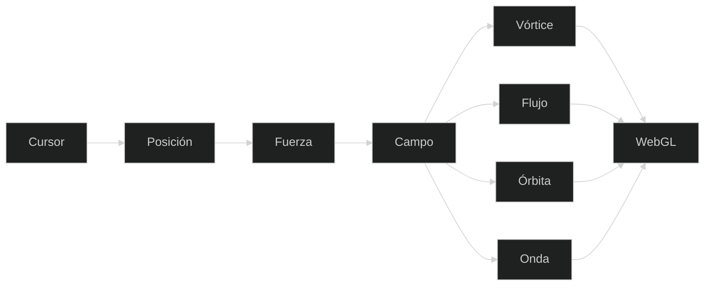

<div align="center">

<a href="https://vortex-gilt-xi.vercel.app/">
  
</a>

<a href="https://vortex-gilt-xi.vercel.app/">
  
</a>

<br/>

<a href="https://vortex-gilt-xi.vercel.app/"></a>
<a href="https://gracianb.github.io/systems-lab/"></a>
<a href="https://gracianb.github.io/project-ohana/"></a>
<a href="https://gracianb.github.io/GracianB/"></a>

<br/><br/>

**No es una captura. Mueve el cursor.**

Miles de muestras. Cuatro reglas. El puntero es la fuerza.

<br/>

[Español](#español) · [English](#english)

</div>

---

## Lo que hace



<div align="center">

### [Abrir Vórtice](https://vortex-gilt-xi.vercel.app/)

</div>

---

<a id="español"></a>

## Español

Vórtice es un campo de partículas en WebGL, del mundo Play de [GracianB](https://gracianb.github.io/GracianB/). No hay un vídeo que se reproduzca. Hay una regla, muchas muestras, y el cursor.

La entrada es mínima. La respuesta no. Atraes, pulsas, dejas estela, cambias la regla, la paleta, el fondo, la densidad y la energía. No hay una configuración correcta. Hay una que te gusta.

### Cuatro campos

La misma simulación, cuatro comportamientos. Se cambian con `1` `2` `3` `4` o desde el panel.

| Tecla | Campo | Qué hace |
| --- | --- | --- |
| `1` | Vórtice | Las muestras giran hacia el puntero |
| `2` | Flujo | Siguen una corriente |
| `3` | Órbita | Rodean el centro, en dos radios |
| `4` | Onda | El campo responde como un pulso |

### Mandos

| | |
| --- | --- |
| Puntero | El campo sigue al cursor |
| Clic y mantener | Fuerza local. Si arrastras, la fuerza se mueve y deja estela |
| `Espacio` | Pulso de todo el campo |
| `F` | Pantalla completa |
| `C` | Limpia las estelas |
| `R` | Reinicia las muestras |
| `S` | Guarda un PNG |

En el panel: cantidad de muestras, energía, estela, paleta y fondo.

### Color

Seis paletas, no cinco: Espectro, Aurora, Brasa, Hielo, Plata y Solar. Hielo es el acento de Play, `#7AF3FF`, sobre `#06070A`.

Seis fondos: Vacío, Tinta, Abismo, Pizarra, Niebla y Papel. Papel es el claro.

Unas combinaciones para empezar, no para obedecer:

| | | |
| --- | --- | --- |
| Vórtice | Hielo | Vacío |
| Flujo | Aurora | Niebla |
| Órbita | Plata | Abismo |
| Onda | Brasa | Pizarra |

### Por qué WebGL

Miles de puntos, cada frame, con estela. Una regla pequeña, repetida, se ve como un campo vivo. Más muestras tienen que sentirse como más atmósfera, no como más espera. Por eso la densidad se puede bajar.

El audio de la pieza, Sustained Focus, suena en el propio sitio. También está en [Suno](https://suno.com/s/Zq81WeM02AVZnhuC).

### Dónde vive

Ohana es el juego: estado, salas, evolución. Vórtice es el campo: rendering, movimiento, densidad. Los dos hacen lo mismo desde lados distintos. Una regla se convierte en experiencia.

| | |
| --- | --- |
| Lab | [Systems Lab](https://gracianb.github.io/systems-lab/) |
| Juego | [Ohana](https://gracianb.github.io/project-ohana/) |
| Hub | [GracianB](https://gracianb.github.io/GracianB/) |
| Deck | [Professional Deck](https://gracianb.github.io/professional-deck/) |
| Yoga | [Yoga](https://gracianb.github.io/yoga-instructor/) |

La experiencia que se abre no pide cuenta. El campo corre en el navegador.

Para verlo en local:

```bash
git clone https://github.com/GracianB/vortex.git
cd vortex
npm install
npm run dev
```

Abre [http://localhost:8080](http://localhost:8080). Hace falta Node. `npm run dev` levanta Vite en el puerto 8080.

El despliegue live es Vercel: [vortex-gilt-xi.vercel.app](https://vortex-gilt-xi.vercel.app/).

---

<a id="english"></a>

## English

Vórtice is a WebGL particle field. Not a video. A rule, many samples, and the cursor.

Four behaviours, keys `1` to `4`: vortex (samples turn toward the pointer), flow (a current), orbit (two radii around the centre), wave (the field answers like a pulse).

Pointer follows. Click and hold is a local force; drag it and it leaves a trail. Space is a global pulse. `F` fullscreen, `C` clears trails, `R` resets, `S` saves a PNG.

Six palettes: Spectrum, Aurora, Ember, Ice, Silver, Solar. Six backgrounds: Void, Ink, Abyss, Slate, Fog, Paper.

The open experience asks for no account. The field runs in the browser. Locally: Node, `npm install`, `npm run dev`, port 8080.

It sits next to [Ohana](https://gracianb.github.io/project-ohana/) in [Play](https://gracianb.github.io/systems-lab/). Ohana is the game. Vórtice is the field. Same idea: a rule becomes an experience.

[Open it](https://vortex-gilt-xi.vercel.app/).

---

<div align="center">

<a href="https://calendar.app.google/n99psBFktwYyoAWi9"></a>
<a href="mailto:gracianbaenagonzalez@gmail.com"></a>
<a href="https://www.linkedin.com/in/gracianbaena"></a>

<br/><br/>

[Vórtice](https://vortex-gilt-xi.vercel.app/) · [Lab](https://gracianb.github.io/systems-lab/) · [Ohana](https://gracianb.github.io/project-ohana/) · [Hub](https://gracianb.github.io/GracianB/)

<br/>

<a href="https://vortex-gilt-xi.vercel.app/">
  
</a>

<sub>Murcia · 2026</sub>

</div>
